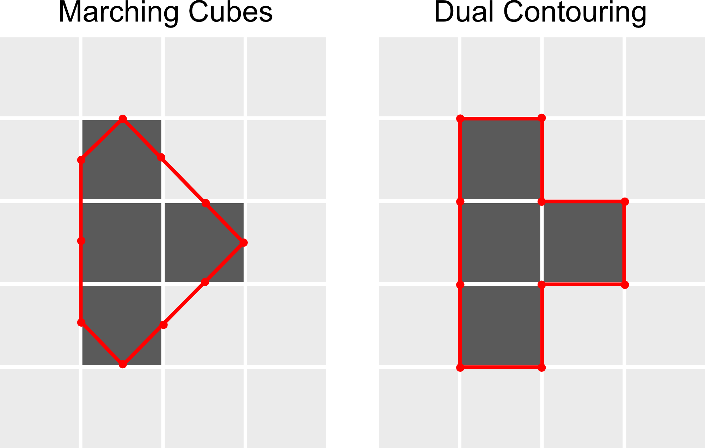

# sparse-cubes

Mesh generation for `(N, 3)` voxel indices - i.e. the equivalent of a 3D
sparse matrix in COOrdinate format - using a simple dual contouring implementation

Running dual contouring directly on sparse voxels is faster and importantly much
more memory efficient than converting to a dense 3d matrix and using marching cubes from
e.g. `sklearn`.

In brief, dual contouring produces sharper meshes than marching cubes
by placing vertices at the edges of voxels rather than the centers:

<picture>
  <source media="(prefers-color-scheme: dark)" srcset="_static/dual_contouring_dark.png">
  <source media="(prefers-color-scheme: light)" srcset="_static/dual_contouring.png">
  
</picture>

Please see [this blog](https://www.boristhebrave.com/2018/04/15/dual-contouring-tutorial/) for an excellent introduction to dual contouring.
See also notes at the end of the README.

## Install

Install latest version from PyPI:

```bash
pip3 install sparse-cubes -U
```

To install the developer version from Github:

```bash
pip3 install git+https://github.com/navis-org/sparse-cubes.git
```

The only dependencies are `numpy` and `trimesh`. Will use `fastremap` if present.

## Usage

```python
>>> import sparsecubes as sc
>>> import numpy as np
>>> # Indices for two adjacent voxels
>>> voxel_xyz = np.array([[0, 0, 0],
...                       [0, 0, 1]],
...                      dtype='uint32')
>>> m = sc.dual_contour(voxel_xyz)
>>> m
<trimesh.Trimesh(vertices.shape=(12, 3), faces.shape=(20, 3))>
>>> m.is_winding_consistent
True
```

## Notes
- The mesh might have non-manifold edges. Trimesh will report these
  meshes as not watertight but in the very literal definition they do hold water.
- This implementation is very basic; I never looked into how to optimize vertex
  placement which is why we get a stepped appearance on diagonal surfaces.
