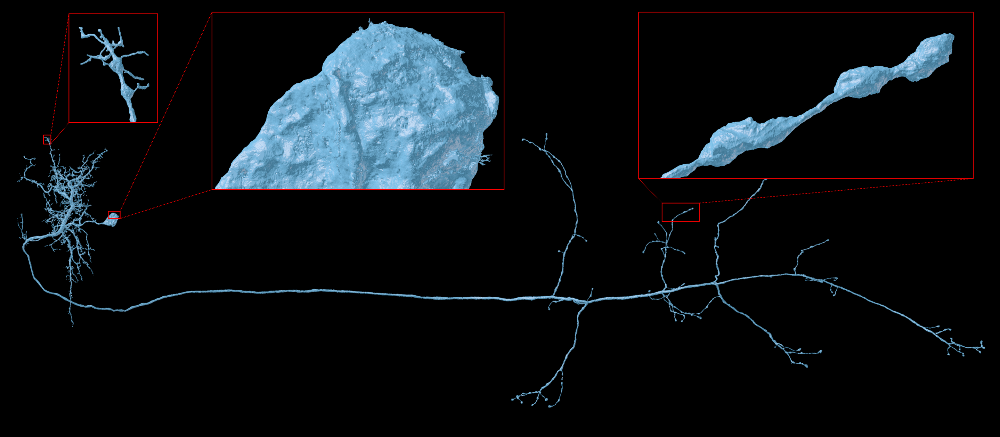

# sparse-cubes

Fast, memory-efficient meshing and skeletonization for sparse voxel data:
`(N, 3)` arrays of voxel indices - i.e. the 3D equivalent of a sparse matrix in
COOrdinate (COO) format.

Everything works *directly* on the sparse voxel coordinates - no dense 3D grid is
ever allocated. Memory scales with the number of (surface) voxels rather than the
volume's bounding box, so `sparse-cubes` handles large, thin, low-occupancy
objects (e.g. neurons spanning a huge bounding box) that would be wasteful to
densify for `scikit-image` (marching cubes / thinning) or `kimimaro`.

## Features

- **Meshing** - turn surface voxels into a mesh, either **smooth** (SurfaceNets)
  or **blocky** (culled cube faces à la Minecraft).
- **Lossless simplification** - merge coplanar blocky faces into maximal
  rectangles (greedy meshing), typically ~2x fewer triangles.
- **Thinning** - peel voxels down to a 1-voxel-wide, topology-preserving medial
  curve.
- **Centerline skeletons** - extract a node/edge graph (with radii); export to
  SWC / networkx / trimesh.
- **TEASAR skeletons** - well-centered medial-axis skeletons with radii, a sparse
  reimplementation of [`kimimaro`](https://github.com/seung-lab/kimimaro).



*Example using a set of 789M voxels, meshed in 8:40mins on an M3 MacBook with 32GB memory. The resulting mesh has 177M faces.*

## Install

Install latest version from PyPI:

```bash
pip3 install sparse-cubes -U
```

To install the developer version from Github:

```bash
pip3 install git+https://github.com/navis-org/sparse-cubes.git
```

The only required dependencies are `numpy` and `trimesh`. Will use `fastremap` if
present. Optional extras:

- `pip install sparse-cubes[recommended]` - the
  [`dijkstra3d-sparse`](https://pypi.org/project/dijkstra3d-sparse/) accelerator,
  which considerably speeds up `teasar_skeletonize`.
- `pip install sparse-cubes[skeleton]` - scipy (for `teasar_skeletonize` and
  `radii=True`) plus the recommended `dijkstra3d-sparse` accelerator.
- `pip install sparse-cubes[graph]` - networkx (for `to_networkx`).

## Quickstart

Meshing:

```python
>>> import sparsecubes as sc
>>> import numpy as np
>>> # Indices for two adjacent voxels
>>> voxel_xyz = np.array([[0, 0, 0],
...                       [0, 0, 1]],
...                      dtype='uint32')
>>> # Smooth (SurfaceNets) mesh by default; vertices are floats
>>> m = sc.mesh(voxel_xyz)
>>> m
<trimesh.Trimesh(vertices.shape=(12, 3), faces.shape=(20, 3))>
>>> m.is_winding_consistent
True
>>> # Pass smooth=False (or call sc.culled_faces) for the blocky, integer mesh
>>> m_blocky = sc.mesh(voxel_xyz, smooth=False)
>>> # ...and simplify=True (or sc.greedy_faces) to merge coplanar faces losslessly
>>> m_small = sc.mesh(voxel_xyz, smooth=False, simplify=True)
```

Skeletonization:

```python
>>> # `thin` peels the object to a 1-voxel medial curve (a subset of the input)
>>> thinned = sc.thin(voxels)
>>> # `skeletonize` thins and extracts the centerline graph in one step
>>> skel = sc.skeletonize(voxels, min_branch_length=3, radii=True)
>>> # ...or trace a well-centered TEASAR medial-axis skeleton
>>> skel = sc.teasar_skeletonize(voxels, spacing=(1, 1, 1), min_branch_length=3)
>>> skel.nodes            # (M, 3) voxel coordinates
>>> skel.edges            # (K, 2) undirected node-index pairs
>>> skel.radii            # (M,) distance-to-boundary per node (needs scipy)
>>> skel.to_swc("cell.swc")          # SWC table (navis/NEURON-friendly)
```

---

## Meshing modes

`sparse-cubes` finds the exposed faces of your voxels and turns them into a
mesh. There are two ways to place the vertices, selected with the `smooth`
flag on `mesh()` (or via the explicit `surface_nets()` / `culled_faces()`
functions):

- **Smooth (`sc.mesh(voxels)` / `sc.surface_nets(voxels)`, the default).** A
  naive [SurfaceNets](https://0fps.net/2012/07/12/smooth-voxel-terrain-part-2/)
  pass: one vertex per surface cell, placed at the centroid of the surface
  crossings around it. This is a *dual* method (a cousin of dual contouring) and
  smooths the staircase you would otherwise get on diagonal surfaces. Vertices
  are floats.
- **Blocky (`sc.mesh(voxels, smooth=False)` / `sc.culled_faces(voxels)`).** Each
  exposed voxel face becomes an axis-aligned quad with corners on the integer
  voxel grid ("culled cube faces", à la Minecraft). Fast and keeps the input
  integer dtype, but diagonal surfaces come out as 90° steps. This is the
  historical output.

### Optional simplification (blocky only)

Pass `simplify=True` (or use `sc.greedy_faces(voxels)`) to merge coplanar faces
of the blocky mesh into maximal rectangles
([greedy meshing](https://0fps.net/2012/06/30/meshing-in-a-minecraft-game/)):

```python
>>> full = sc.mesh(voxels, smooth=False)
>>> small = sc.mesh(voxels, smooth=False, simplify=True)  # ~2x fewer triangles
```

This is **lossless** - the covered surface is identical - and keeps the integer
vertex dtype. It typically roughly halves the triangle count (a flat W×H wall
becomes a single quad instead of W·H quads) at little to no extra cost. Caveat:
like all greedy meshing it can introduce T-junctions, so the simplified mesh may
be "less watertight" than the per-face mesh; it is opt-in for that reason.

Please see [this blog](https://www.boristhebrave.com/2018/04/15/dual-contouring-tutorial/) for an excellent introduction to dual contouring and SurfaceNets.
See also notes at the end of the README.

`sc.dual_contour` and `sc.marching_cubes` still exist as **deprecated aliases**
of `sc.mesh` (their old `interpolate` argument maps to `smooth`) but emit a
`DeprecationWarning` - neither name ever described what this library actually
does.

## Thinning, centerline & TEASAR skeletons

The same sparse machinery can *thin* voxels down to a one-voxel-wide medial
curve and extract a **centerline skeleton** (a node/edge graph), or trace a
**TEASAR** medial-axis skeleton (the algorithm behind
[`kimimaro`](https://github.com/seung-lab/kimimaro)). Like the meshing, both run
directly on the `(N, 3)` coordinates - no dense grid is ever allocated - so they
work on large, sparse objects (e.g. neurons spanning a huge bounding box at low
occupancy) that would be wasteful to densify for `scikit-image`'s thinning or
`kimimaro`'s dense distance transform.

```python
>>> import sparsecubes as sc
>>> # `thin` peels the object to a 1-voxel medial curve (a subset of the input)
>>> thinned = sc.thin(voxels)
>>> # `skeletonize` thins and extracts the centerline graph in one step
>>> skel = sc.skeletonize(voxels, min_branch_length=3, radii=True)
>>> skel.nodes            # (M, 3) voxel coordinates
>>> skel.edges            # (K, 2) undirected node-index pairs
>>> skel.radii            # (M,) distance-to-boundary per node (needs scipy)
>>> skel.node_degrees()   # 1 = tip, 2 = along a path, >=3 = branch point
>>> skel.to_swc("cell.swc")          # SWC table (navis/NEURON-friendly)
>>> skel.to_networkx()               # networkx.Graph (needs networkx)
>>> skel.to_path3d()                 # trimesh.path.Path3D for visualisation
```

`thin` uses topological thinning (Lee/Palágyi-style simple-point removal with
sub-field-parallel deletion) and **preserves topology** - connected components
and loops are kept, endpoints are not eroded. It matches
`skimage.morphology.skeletonize(..., method="lee")` topologically but stays
sparse.

For a well-centered medial-axis skeleton with clean radii, use `teasar_skeletonize`
(a sparse reimplementation of TEASAR / `kimimaro`). It roots the object at its
geodesically furthest point and traces shortest paths - through a penalty field
that hugs the centerline - to the most distant remaining voxel, invalidating a
distance-scaled tube around each path. Every stage (distance-from-boundary field,
geodesic distances, path finding, invalidation) runs on the sparse voxels via
`scipy` KD-trees and `scipy.sparse.csgraph`, so memory scales with the voxel count
- never the bounding-box volume `kimimaro`'s dense EDT would need.

```python
>>> skel = sc.teasar_skeletonize(voxels, spacing=(1, 1, 1), min_branch_length=3)
>>> skel.radii            # (M,) distance-from-boundary (medial radius) per node
>>> skel.to_swc("cell.swc")
```

The output is the same `Skeleton` object. Note TEASAR always returns an **acyclic
tree/forest** - loops are broken (an annulus becomes an open curve), matching SWC
conventions - whereas `thin` preserves loops. The invalidation ball radius is
`scale * DBF + const`; `const` is in physical units (defaults to ~4 voxels), so
unlike `kimimaro`'s nanometre-scale default of 300 it is sensible in index space.

The `branching` parameter dials the speed/fidelity tradeoff (all yield an acyclic
tree):

- `branching="exact"` (default) - one shortest-path search per path, grafting each
  branch onto the skeleton (`kimimaro`'s `fix_branching`). Most faithful, but
  `O(paths)` Dijkstra runs, so it gets slow on very large objects.
- `branching="tree"` - reuse a single root Dijkstra tree. Fastest, but junctions
  are coarser.
- `branching="fast"` - a multi-source variant that grafts a batch of paths per
  search: a middle ground, roughly an order of magnitude faster than `"exact"` on
  large objects and slightly coarser. Pass an int to set the batch size explicitly
  (larger is faster and coarser).

```python
>>> skel = sc.teasar_skeletonize(big_voxels, branching="tree")   # fastest
>>> skel = sc.teasar_skeletonize(big_voxels, branching="fast")   # middle ground
```

**Scope / when to use something else.** Topological thinning (`thin`) preserves
loops but is sensitive to surface noise and sprouts spurs (prune with
`min_branch_length`); TEASAR (`teasar_skeletonize`) gives smoother, well-centered
paths with radii but breaks loops and is slower on very large objects (pure-`scipy`
Dijkstra). Both shine on large, thin, sparse structures - the same regime as the
rest of `sparse-cubes`. For small/fat solids, densifying and calling
`scikit-image` / `kimimaro` directly is simpler and faster.

`teasar_skeletonize` transparently uses [`dijkstra3d-sparse`](https://pypi.org/project/dijkstra3d-sparse/)
when it is installed to run Dijkstra straight over the voxel coordinates, which is
markedly faster than the pure-`scipy` `csgraph` fallback. It is **optional but highly
recommended** - `sparse-cubes` falls back to scipy without it. It ships with the
`skeleton` extra, or install it on its own with `pip install sparse-cubes[recommended]`.

## Notes
- The mesh might have non-manifold edges. Trimesh will report these
  meshes as not watertight but in the very literal definition they do hold water.
- The names `dual_contour` / `marching_cubes` were misnomers: the blocky path is
  really culled cube faces (vertices only ever land on cube corners) and the
  smooth default is naive dual/SurfaceNets placement. Full feature-preserving
  dual contouring (QEF-based placement using surface normals) is not
  implemented.
