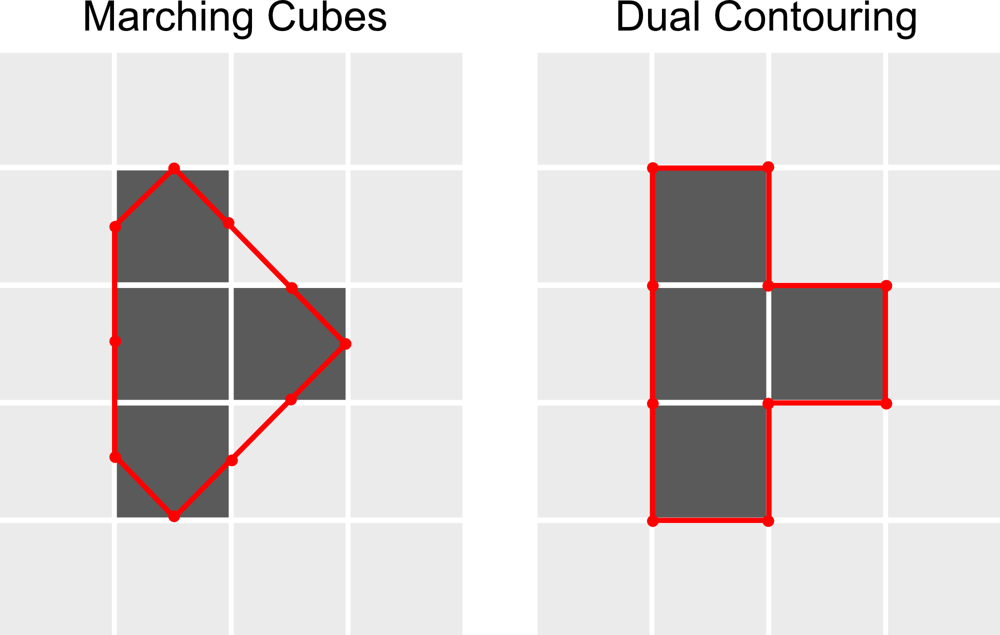

# sparse-cubes

Mesh generation for `(N, 3)` voxel indices - i.e. the equivalent of a 3D
sparse matrix in COOrdinate format.

`sparse-cubes` works directly on the sparse surface voxels which is faster and,
importantly, much more memory efficient than converting to a dense 3D matrix and
using e.g. marching cubes from `scikit-image`. Memory scales with the number of
*surface* voxels rather than the volume's bounding box.

## Meshing modes

`sparse-cubes` finds the exposed faces of your voxels and turns them into a
mesh. There are two ways to place the vertices, selected with the `smooth`
flag on `mesh()` (or via the explicit `surface_nets()` / `culled_faces()`
functions):

- **Smooth (`sc.mesh(voxels)` / `sc.surface_nets(voxels)`, the default).** A
  naive [SurfaceNets](https://0fps.net/2012/07/12/smooth-voxel-terrain-part-2/)
  pass: one vertex per surface cell, placed at the centroid of the surface
  crossings around it. This is a *dual* method (a cousin of dual contouring) and
  smooths the staircase you would otherwise get on diagonal surfaces. Vertices
  are floats.
- **Blocky (`sc.mesh(voxels, smooth=False)` / `sc.culled_faces(voxels)`).** Each
  exposed voxel face becomes an axis-aligned quad with corners on the integer
  voxel grid ("culled cube faces", à la Minecraft). Fast and keeps the input
  integer dtype, but diagonal surfaces come out as 90° steps. This is the
  historical output.

### Optional simplification (blocky only)

Pass `simplify=True` (or use `sc.greedy_faces(voxels)`) to merge coplanar faces
of the blocky mesh into maximal rectangles
([greedy meshing](https://0fps.net/2012/06/30/meshing-in-a-minecraft-game/)):

```python
>>> full = sc.mesh(voxels, smooth=False)
>>> small = sc.mesh(voxels, smooth=False, simplify=True)  # ~2x fewer triangles
```

This is **lossless** - the covered surface is identical - and keeps the integer
vertex dtype. It typically roughly halves the triangle count (a flat W×H wall
becomes a single quad instead of W·H quads) at little to no extra cost. Caveat:
like all greedy meshing it can introduce T-junctions, so the simplified mesh may
be "less watertight" than the per-face mesh; it is opt-in for that reason.

<picture>
  <source media="(prefers-color-scheme: dark)" srcset="_static/dual_contouring_dark.png">
  <source media="(prefers-color-scheme: light)" srcset="_static/dual_contouring.png">
  
</picture>

Please see [this blog](https://www.boristhebrave.com/2018/04/15/dual-contouring-tutorial/) for an excellent introduction to dual contouring and SurfaceNets.
See also notes at the end of the README.

## Install

Install latest version from PyPI:

```bash
pip3 install sparse-cubes -U
```

To install the developer version from Github:

```bash
pip3 install git+https://github.com/navis-org/sparse-cubes.git
```

The only dependencies are `numpy` and `trimesh`. Will use `fastremap` if present.

## Usage

```python
>>> import sparsecubes as sc
>>> import numpy as np
>>> # Indices for two adjacent voxels
>>> voxel_xyz = np.array([[0, 0, 0],
...                       [0, 0, 1]],
...                      dtype='uint32')
>>> # Smooth (SurfaceNets) mesh by default; vertices are floats
>>> m = sc.mesh(voxel_xyz)
>>> m
<trimesh.Trimesh(vertices.shape=(12, 3), faces.shape=(20, 3))>
>>> m.is_winding_consistent
True
>>> # Pass smooth=False (or call sc.culled_faces) for the blocky, integer mesh
>>> m_blocky = sc.mesh(voxel_xyz, smooth=False)
>>> # ...and simplify=True (or sc.greedy_faces) to merge coplanar faces losslessly
>>> m_small = sc.mesh(voxel_xyz, smooth=False, simplify=True)
```

`sc.dual_contour` and `sc.marching_cubes` still exist as **deprecated aliases**
of `sc.mesh` (their old `interpolate` argument maps to `smooth`) but emit a
`DeprecationWarning` - neither name ever described what this library actually
does.

## Notes
- The mesh might have non-manifold edges. Trimesh will report these
  meshes as not watertight but in the very literal definition they do hold water.
- The names `dual_contour` / `marching_cubes` were misnomers: the blocky path is
  really culled cube faces (vertices only ever land on cube corners) and the
  smooth default is naive dual/SurfaceNets placement. Full feature-preserving
  dual contouring (QEF-based placement using surface normals) is not
  implemented.
