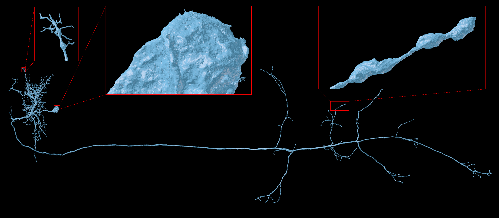

# sparse-cubes

Fast, memory-efficient operations on sparse voxel data:
`(N, 3)` arrays of voxel indices - i.e. the 3D equivalent of a sparse matrix in
COOrdinate (COO) format.

Everything works *directly* on the sparse voxel coordinates - no dense 3D grid is
ever allocated. Memory scales with the number of (surface) voxels rather than the
volume's bounding box, so `sparse-cubes` handles large, thin, low-occupancy
objects (e.g. neurons spanning a huge bounding box) that would be wasteful to
densify for `scikit-image` (marching cubes / thinning) or `kimimaro`.

## Features

- **Meshing** - turn surface voxels into a mesh, either **smooth** (SurfaceNets)
  or **blocky** (culled cube faces à la Minecraft).
- **Voxelization** - the inverse: turn a triangle mesh into sparse voxels,
  **solid** (filled interior) or surface-only.
- **Lossless simplification** - merge coplanar blocky faces into maximal
  rectangles (greedy meshing), typically ~2x fewer triangles.
- **Thinning** - peel voxels down to a 1-voxel-wide, topology-preserving medial
  curve.
- **Centerline skeletons** - extract a node/edge graph (with radii) from thinned voxels; export to
  SWC / networkx / trimesh.
- **TEASAR skeletons** - well-centered medial-axis skeletons with radii, a sparse
  reimplementation of [`kimimaro`](https://github.com/seung-lab/kimimaro).
- **Parametric tubes** - per skeleton node, the cross-section profile `r(θ)` as a
  truncated Fourier series: 64 bytes a node, two independent LOD axes, and
  evaluable directly in a shader.
- **Primitives** - morphology (dilate/erode/open/close), set algebra, connected
  components and measurements, in `sparsecubes.binary` and `sparsecubes.measure`.
- **Adjacency & downsampling** - the voxel graph as an explicit edge list, and
  pooling onto a coarser lattice (optionally connectivity-safe).
- **Filtering** - Gaussian smoothing, arbitrary kernels and grayscale
  morphology over sparse voxels, exact to `scipy.ndimage` but without the dense
  grid.
- **Sparse-array interop** - every voxel-taking function also accepts a 3-D
  `scipy.sparse.coo_array` and hands one back where that makes sense.



*Example using a set of 789M voxels, meshed in 8:40mins on an M3 MacBook with 32GB memory. The resulting mesh has 177M faces.*

## Install

Install latest version from PyPI:

```bash
pip3 install sparse-cubes -U
```

To install the developer version from Github:

```bash
pip3 install git+https://github.com/navis-org/sparse-cubes.git
```

Required dependencies are `numpy`, `trimesh` and
[`dijkstra3d-sparse`](https://pypi.org/project/dijkstra3d-sparse/) (the coordinate
accelerator that `mesh` and the skeletonizers run on). Will use `fastremap` if
present. Optional extras:

- `pip install sparse-cubes[skeleton]` - scipy (for `teasar_skeletonize` and
  `radii=True`).
- `pip install sparse-cubes[graph]` - networkx (for `to_networkx`).

## Quickstart

Meshing:

```python
>>> import sparsecubes as sc
>>> import numpy as np
>>> # Indices for two adjacent voxels
>>> voxel_xyz = np.array([[0, 0, 0],
...                       [0, 0, 1]],
...                      dtype='uint32')
>>> # Smooth (SurfaceNets) mesh by default; vertices are floats
>>> m = sc.mesh(voxel_xyz)
>>> m
<trimesh.Trimesh(vertices.shape=(12, 3), faces.shape=(20, 3))>
>>> m.is_winding_consistent
True
>>> # Pass smooth=False (or call sc.culled_faces) for the blocky, integer mesh
>>> m_blocky = sc.mesh(voxel_xyz, smooth=False)
>>> # ...and simplify=True (or sc.greedy_faces) to merge coplanar faces losslessly
>>> m_small = sc.mesh(voxel_xyz, smooth=False, simplify=True)
```

Voxelization (the inverse of `sc.mesh`):

```python
>>> import trimesh as tm
>>> m = tm.creation.icosphere(subdivisions=3, radius=10)
>>> # Solid by default: surface + filled interior
>>> vox = sc.voxelize(m, spacing=1.0)
>>> vox.shape
(4169, 3)
>>> # ...or just the surface shell
>>> shell = sc.voxelize(m, spacing=1.0, solid=False)
>>> # Anisotropic voxels are fine, and the result feeds straight back in
>>> vox = sc.voxelize(m, spacing=(1.0, 1.0, 2.0))
>>> skel = sc.thin_skeletonize(sc.voxelize(m, 1.0))
```

Primitives:

```python
>>> # Morphology and set algebra (voxels in -> voxels out)
>>> grown = sc.binary.dilate(voxels, iterations=2)
>>> clean = sc.binary.opening(voxels)          # strip specks and thin spurs
>>> both = sc.binary.intersection(voxels, other)
>>> # Labelling and measurements (voxels in -> numbers/labels out)
>>> n, labels = sc.measure.connected_components(voxels)
>>> body = sc.measure.largest_component(voxels)
>>> sc.measure.volume(voxels, spacing=(1, 1, 2))
>>> sc.measure.distance_transform(voxels)      # exact, sparse EDT
```

Skeletonization:

```python
>>> # `thin` peels the object to a 1-voxel medial curve (a subset of the input)
>>> thinned = sc.binary.thin(voxels)
>>> # `thin_skeletonize` thins and extracts the centerline graph in one step
>>> skel = sc.thin_skeletonize(voxels, min_branch_length=3, radii=True)
>>> # ...or trace a well-centered TEASAR medial-axis skeleton
>>> skel = sc.teasar_skeletonize(voxels, spacing=(1, 1, 1), min_branch_length=3)
>>> skel.nodes            # (M, 3) voxel coordinates
>>> skel.edges            # (K, 2) undirected node-index pairs
>>> skel.radii            # (M,) distance-to-boundary per node (needs scipy)
>>> skel.to_swc("cell.swc")          # SWC table (navis/NEURON-friendly)
```

---

## Meshing modes

`sparse-cubes` finds the exposed faces of your voxels and turns them into a
mesh. There are two ways to place the vertices, selected with the `smooth`
flag on `mesh()` (or via the explicit `surface_nets()` / `culled_faces()`
functions):

- **Smooth (`sc.mesh(voxels)` / `sc.surface_nets(voxels)`, the default).** A
  naive [SurfaceNets](https://0fps.net/2012/07/12/smooth-voxel-terrain-part-2/)
  pass: one vertex per surface cell, placed at the centroid of the surface
  crossings around it. This is a *dual* method (a cousin of dual contouring) and
  smooths the staircase you would otherwise get on diagonal surfaces. Vertices
  are floats.
- **Blocky (`sc.mesh(voxels, smooth=False)` / `sc.culled_faces(voxels)`).** Each
  exposed voxel face becomes an axis-aligned quad with corners on the integer
  voxel grid ("culled cube faces", à la Minecraft). Fast and keeps the input
  integer dtype, but diagonal surfaces come out as 90° steps. This is the
  historical output.

### Optional simplification (blocky only)

Pass `simplify=True` (or use `sc.greedy_faces(voxels)`) to merge coplanar faces
of the blocky mesh into maximal rectangles
([greedy meshing](https://0fps.net/2012/06/30/meshing-in-a-minecraft-game/)):

```python
>>> full = sc.mesh(voxels, smooth=False)
>>> small = sc.mesh(voxels, smooth=False, simplify=True)  # ~2x fewer triangles
```

This is **lossless** - the covered surface is identical - and keeps the integer
vertex dtype. It typically roughly halves the triangle count (a flat W×H wall
becomes a single quad instead of W·H quads) at little to no extra cost. Caveat:
like all greedy meshing it can introduce T-junctions, so the simplified mesh may
be "less watertight" than the per-face mesh; it is opt-in for that reason.

Please see [this blog](https://www.boristhebrave.com/2018/04/15/dual-contouring-tutorial/) for an excellent introduction to dual contouring and SurfaceNets.
See also notes at the end of the README.

`sc.dual_contour` and `sc.marching_cubes` still exist as **deprecated aliases**
of `sc.mesh` (their old `interpolate` argument maps to `smooth`) but emit a
`DeprecationWarning` - neither name ever described what this library actually
does.

## Voxelization

`sc.voxelize` is the inverse of `sc.mesh`: it rasterizes a `trimesh.Trimesh` (or a
`(vertices, faces)` pair) into the same `(N, 3)` integer representation, in two
stages that both stay sparse.

The **surface** stage is an exact conservative rasterization - a voxel is emitted
iff the triangle genuinely intersects its cube, decided by a separating-axis test
rather than by point sampling. The **interior** stage is a scanline parity fill:
each triangle is rasterized in the XY projection over voxel column centres, the
resulting Z crossings are sorted per column and paired up, and the cells between
a pair are emitted as runs. Memory is proportional to the crossings plus the
output, and the even-odd rule means face winding is irrelevant (meshes with
inconsistent normals still work) and enclosed cavities are correctly left empty.

```python
>>> vox = sc.voxelize(mesh, spacing=1.0)               # solid
>>> vox = sc.voxelize(mesh, spacing=1.0, solid=False)  # surface shell only
>>> vox = sc.voxelize(mesh, spacing=(0.5, 0.5, 1.0))   # anisotropic
>>> vox = sc.voxelize(mesh, spacing=1.0, fill="winding", axes=3)  # broken mesh
```

Voxel `i` along an axis covers `[(i - 0.5) * spacing, (i + 0.5) * spacing)`, so
its *centre* is at `i * spacing`. This matches trimesh's `VoxelGrid` convention
and makes the round trip line up: `sc.mesh(sc.voxelize(m, s), spacing=s)` lands
back on top of the original mesh. Indices are absolute and may be negative.

**Why not just use trimesh?** `mesh.voxelized(pitch)` already returns sparse
*surface* voxels without densifying, though it approximates - it subdivides faces
and keeps the cells containing the resulting vertices, so it misses cells a
triangle only clips through a corner. The gap is solid voxelization: every fill
path in trimesh materializes the full bounding box (`fill('holes')` runs
`scipy.ndimage.binary_fill_holes` on a dense array, and `fill('base')` allocates a
cube of the largest coordinate), which is exactly what this library exists to
avoid. `sc.voxelize` fills sparsely, so peak memory tracks the object rather than
its bounding box.

### Broken meshes

Voxelizing is a natural way to *repair* a mesh - `sc.voxelize` then `sc.mesh`
rebuilds it from scratch - so it is worth being precise about what survives the
round trip. Inconsistent or flipped normals, non-manifold edges, degenerate
triangles and stray unreferenced vertices are all handled silently and exactly.
Three things are not, and each has a knob:

| defect | what the default does | fix |
| --- | --- | --- |
| **holes** | the columns through the hole never close, so a whole span of the solid is dropped | `axes=3` |
| **self-intersection, nested or duplicated surfaces** | even-odd carves the overlap out as an enclosed void | `fill="winding"` |
| **partial fills** | leftover shell fragments graze each other, and `sc.mesh` cannot close a manifold surface around them | `sc.binary.make_manifold` |

`fill` picks the rule that decides what is inside. The default `"parity"`
(even-odd) ignores winding entirely, which is why flipped normals cost nothing;
its blind spot is anything that stops a column's crossings alternating
inside/outside. `"winding"` (nonzero) unions overlapping and nested shells and
shrugs off duplicated faces, but it does need consistent winding - with normals
flipped at random it welds concave gaps shut. Neither rule invents a surface that
is not there, so neither recovers a hole.

`axes` is what recovers holes. `axes=3` fills along X, Y and Z and keeps the
voxels at least two sweeps claim; a hole that breaks the Z columns through it
usually leaves the X and Y columns intact. On a sphere with an entire cap
removed, the default returns 63% of the true volume and `axes=3` returns 112%
(against the ~118% every conservative voxelization of that resolution returns).
It costs three fills, so it is opt-in.

Every call also reports what it saw. One warning fires when columns do not close,
with an estimate of how much solid that costs; a second fires when the even-odd
and winding rules disagree, which is the only signal that an otherwise plausible
result has an overlap carved out of it. A clean mesh triggers neither.

One thing no knob changes: conservative voxelization claims every voxel the
surface touches, so the solid grows by a roughly constant ~0.7 voxels outward
regardless of resolution. Round-tripping a mesh inflates it; resolution shrinks
the error relative to the object, not relative to the grid.

## Thinning, centerline & TEASAR skeletons

The same sparse machinery can *thin* voxels down to a one-voxel-wide medial
curve and extract a **centerline skeleton** (a node/edge graph), or trace a
**TEASAR** medial-axis skeleton (the algorithm behind
[`kimimaro`](https://github.com/seung-lab/kimimaro)). Like the meshing, both run
directly on the `(N, 3)` coordinates - no dense grid is ever allocated - so they
work on large, sparse objects (e.g. neurons spanning a huge bounding box at low
occupancy) that would be wasteful to densify for `scikit-image`'s thinning or
`kimimaro`'s dense distance transform.

```python
>>> import sparsecubes as sc
>>> # `thin` peels the object to a 1-voxel medial curve (a subset of the input)
>>> thinned = sc.binary.thin(voxels)
>>> # `thin_skeletonize` thins and extracts the centerline graph in one step
>>> skel = sc.thin_skeletonize(voxels, min_branch_length=3, radii=True)
>>> skel.nodes            # (M, 3) voxel coordinates
>>> skel.edges            # (K, 2) undirected node-index pairs
>>> skel.radii            # (M,) distance-to-boundary per node (needs scipy)
>>> skel.node_degrees()   # 1 = tip, 2 = along a path, >=3 = branch point
>>> skel.to_swc("cell.swc")          # SWC table (navis/NEURON-friendly)
>>> skel.to_networkx()               # networkx.Graph (needs networkx)
>>> skel.to_path3d()                 # trimesh.path.Path3D for visualisation
```

`thin` uses topological thinning (Lee/Palágyi-style simple-point removal with
sub-field-parallel deletion) and **preserves topology** - connected components
and loops are kept, endpoints are not eroded. It matches
`skimage.morphology.skeletonize(..., method="lee")` topologically but stays
sparse.

For a well-centered medial-axis skeleton with clean radii, use `teasar_skeletonize`
(a sparse reimplementation of TEASAR / `kimimaro`). It roots the object at its
geodesically furthest point and traces shortest paths - through a penalty field
that hugs the centerline - to the most distant remaining voxel, invalidating a
distance-scaled tube around each path. Every stage (distance-from-boundary field,
geodesic distances, path finding, invalidation) runs on the sparse voxels via
`scipy` KD-trees and `scipy.sparse.csgraph`, so memory scales with the voxel count
- never the bounding-box volume `kimimaro`'s dense EDT would need.

```python
>>> skel = sc.teasar_skeletonize(voxels, spacing=(1, 1, 1), min_branch_length=3)
>>> skel.radii            # (M,) distance-from-boundary (medial radius) per node
>>> skel.to_swc("cell.swc")
```

The output is the same `Skeleton` object. Note TEASAR always returns an **acyclic
tree/forest** - loops are broken (an annulus becomes an open curve), matching SWC
conventions - whereas `thin` preserves loops. The invalidation ball radius is
`scale * DBF + const`; `const` is in physical units (defaults to ~4 voxels), so
unlike `kimimaro`'s nanometre-scale default of 300 it is sensible in index space.

The `branching` parameter dials the speed/fidelity tradeoff (all yield an acyclic
tree):

- `branching="exact"` (default) - one shortest-path search per path, grafting each
  branch onto the skeleton (`kimimaro`'s `fix_branching`). Most faithful, but
  `O(paths)` Dijkstra runs, so it gets slow on very large objects.
- `branching="tree"` - reuse a single root Dijkstra tree. Fastest, but junctions
  are coarser.
- `branching="fast"` - a multi-source variant that grafts a batch of paths per
  search: a middle ground, roughly an order of magnitude faster than `"exact"` on
  large objects and slightly coarser. Pass an int to set the batch size explicitly
  (larger is faster and coarser).

```python
>>> skel = sc.teasar_skeletonize(big_voxels, branching="tree")   # fastest
>>> skel = sc.teasar_skeletonize(big_voxels, branching="fast")   # middle ground
```

**Scope / when to use something else.** Topological thinning (`thin`) preserves
loops but is sensitive to surface noise and sprouts spurs (prune with
`min_branch_length`); TEASAR (`teasar_skeletonize`) gives smoother, well-centered
paths with radii but breaks loops and is slower on very large objects (pure-`scipy`
Dijkstra). Both shine on large, thin, sparse structures - the same regime as the
rest of `sparse-cubes`. For small/fat solids, densifying and calling
`scikit-image` / `kimimaro` directly is simpler and faster.

The distance-from-boundary KD-tree query is threaded by default (`workers=-1`).
It is purely a speed knob - the skeleton is identical either way - and the same
parameter is on `sc.measure.distance_transform`. Set `workers=1` when you are
already parallelizing over objects yourself, e.g. inside a `multiprocessing`
pool, where the default would oversubscribe the CPUs:

```python
>>> skel = sc.teasar_skeletonize(voxels)             # all cores (default)
>>> skel = sc.teasar_skeletonize(voxels, workers=1)  # single-threaded
```

`teasar_skeletonize` uses [`dijkstra3d-sparse`](https://pypi.org/project/dijkstra3d-sparse/)
(a required dependency) to run Dijkstra straight over the voxel coordinates, which is
markedly faster than a `scipy` `csgraph` pass over an explicit edge list.

## Parametric tubes

A skeleton plus one radius per node is a tube of circular cross-section. Real
neurites are not circular, and a mesh that captures the difference costs
`O(triangles)`. `tube_coefficients` stores the cross-section instead: per node, the
profile `r(θ)` in the plane normal to the skeleton tangent, as a truncated Fourier
series.

```python
>>> profile = sc.tube_coefficients(voxels, spacing=(16, 16, 16), K=4)
>>> profile.a0        # (M,)     mean radius - this alone is a classic SWC tube
>>> profile.mag       # (M, K)   m_1..m_K, the shape
>>> profile.phase     # (M, K)   φ_1..φ_K
>>> profile.residual  # (M,)     RMS error of having truncated at K, in nm
>>> profile.flags     # (M,)     junction / non-star / escaped / ... per node
```

Each harmonic means something specific: `m_1` is the offset between the skeleton
node and the cross-section's centroid - **nonzero is a diagnostic that the
skeleton is not centred**, not shape; `m_2` is ellipticity, the first term
carrying real geometry; `m_3`/`m_4` mild lobing; `m_k` for large `k` is surface
roughness and segmentation noise.

Magnitude and phase rather than `a_k`/`b_k` because the frame is only defined up
to a rotation about the tangent, which mixes the two. **`mag` is
frame-independent, so truncate on it and never on the Cartesian pair** (available
via `coefficients()` for reconstruction).

### What `K` buys

A 5.56M-voxel arbor at 16 nm, default pipeline (73,671 TEASAR nodes), against the
two things a tube replaces:

- **the voxel cloud**, `(N, 3)` int32 - **66.7 MB**, the input as it arrives
  (`core.pack`'s one-int64-per-voxel keys would be 44.5 MB, so read the ratios
  below as a 1.5x band, not a point estimate);
- **the mesh** of those same voxels, 2.99M vertices and 6.02M triangles -
  **108 MB** as float32 positions plus uint32 indices (216 MB as `sc.mesh`
  actually returns it, float64/int64).

`residual` is `profile.residual` averaged over nodes, against a mean radius of
76 nm:

|  K | B/node |     MB | % of voxels | % of mesh | residual / ā₀ | residual (voxels) |
|---:|-------:|-------:|------------:|----------:|--------------:|------------------:|
|  0 |     32 |   2.36 |       3.5 % |     2.2 % |         0.403 |              1.92 |
|  1 |     40 |   2.95 |       4.4 % |     2.7 % |         0.306 |              1.46 |
|  2 |     48 |   3.54 |       5.3 % |     3.3 % |         0.213 |              1.02 |
|  3 |     56 |   4.13 |       6.2 % |     3.8 % |         0.175 |              0.84 |
|  **4** | **64** | **4.71** | **7.1 %** | **4.4 %** |     **0.147** |          **0.70** |
|  6 |     80 |   5.89 |       8.8 % |     5.5 % |         0.118 |              0.56 |
|  8 |     96 |   7.07 |      10.6 % |     6.5 % |         0.101 |              0.48 |
| 12 |    128 |   9.43 |      14.1 % |     8.7 % |         0.079 |              0.37 |
| 16 |    160 |  11.79 |      17.7 % |    10.9 % |         0.064 |              0.30 |

At the default `K=4` that is **14x smaller than the voxel cloud** (9x against the
packed form) **and 23x smaller than the mesh**. Note the mesh is 1.6x the cloud it
was built from, so meshing is not a compression step - the tube is the only
representation here that is smaller than its own input.

`K=0` is a classic SWC tube - one radius a node, and 40% off. `m_2` alone (`K=2`)
halves that for 3.3% of the mesh, the single best trade in the table, and it
matches what the coefficients say: ellipticity is the one harmonic clearly above
the noise.

**After that there is no knee, so `K` is a budget decision rather than a natural
cut.** How much of the remainder is real shape rather than rasterization is
measurable - a *perfectly circular* voxelized cylinder has a residual too, and all
of it is quantization:

| circle radius | 5 vox | 8 vox | 16 vox |
|---|---:|---:|---:|
| residual / ā₀ at `K=4` | 0.056 | 0.042 | 0.016 |

The neuron's mean radius is 4.8 voxels, so its floor is ~0.05 - and its `K=4`
residual of 0.147 is about **three times** that. Harmonics past `m_2` are still
buying real geometry here, not noise; the curve only approaches the floor near
`K=16`. Two things argue against spending that anyway: the returns per byte are
poor (10.9% of the mesh for 0.064), and the surface *normal* gets worse as `K`
rises, for the reason below. `K=4` is the default as a compromise, not a knee -
raise it if you are storing thick proximal dendrites, and note that a coarser
skeleton is usually the better saving, since axial resampling and `K` are
independent.

Two independent LOD axes fall out: subsample nodes (axial) or lower `K`
(angular). Neither materializes anything - `evaluate()` reads both as arguments:

```python
>>> profile.evaluate()                                  # full detail
>>> profile.evaluate(n_theta=8, k=1, nodes=idx[::4])    # coarse, both axes
>>> pts, normals = profile.evaluate(k=4, k_normal=1, return_normals=True)
```

`return_normals` gives the analytic surface normal — `cross(dp/dθ, dp/ds)`, with
`dp/dθ` in closed form and `dp/ds` a centred difference of the surface at the same
θ. Differencing the surface rather than reusing the stored tangent is what makes a
bouton shade correctly: a taper tilts the surface even where the centreline is
straight.

**Truncate the normal harder than the surface.** `dr/dθ` weights harmonic `k` by
`k`, so once the `m_k` flatten out at the rasterization floor, every further
harmonic adds more slope than shape. Measured on a 16 nm arbor, the normal's
median tilt away from radial is 24° at `k=1` and 35° at `k=4`, while the
silhouette keeps improving — the surface really is that bumpy at a 5-voxel radius,
so this is honest geometry, but it shades like sandpaper. `k_normal` decouples the
two. The floor is ~13°, which is the axial term and is mostly real: smoothing `a0`
three times along the branch only reaches 10°.

`to_gpu_buffer()` emits one `(M, 8 + 2K)` float32 array in shader struct order —
`[pos.xyz, quat.xyzw, a0, a_1..a_K, b_1..b_K]`, 16 floats, **64 bytes a node** at
`K=4` — so a vertex-pulling shader can generate the surface from `vertex_index`
alone, with the LOD as a uniform rather than a buffer swap. `evaluate()` is the
CPU mirror of exactly that loop.

Note it defaults to the **Cartesian** pair, not the magnitude/phase stored above:
a shader walks `Σ a_k cos(kθ) + b_k sin(kθ)` upward by angle addition, so the
whole series costs one `cos` and one `sin` for any `K`, and `dr/dθ` — the surface
normal — falls out of the same loop. Magnitude/phase would need a `cos(φ_k)` per
harmonic per vertex. Pass `form="polar"` if the consumer genuinely needs
magnitudes on the GPU (to threshold or fade harmonics per node).

Extraction runs off the voxel mask, not off a mesh: each node fires `n_theta`
rays in its cross-section plane and takes the first exit, walked as an
Amanatides-Woo DDA over the sparse voxel set. Exits are the exact parametric
crossing of a cell face, so the radii are sub-voxel - finer than the
nearest-voxel-centre estimate `measure.distance_transform` gives. Only the first
exit is taken, so spurious handles and merge artifacts stop mattering.

The walk itself goes to `dijkstra3d_sparse.Graph.ray_exits` when the installed
version has it, and otherwise to a vectorised numpy DDA over a membership probe.
On a 5.56M-voxel arbor (73,671 nodes, 4.7M rays) that is 0.93 s against 3.5 s for
the numpy walk and 9.4 s with no `dijkstra3d-sparse` at all. All three are pinned
bit-for-bit against each other in the tests; `backend=` forces one.

Use `sc.measure.tube_profile(voxels, skeleton, ...)` to fit against a skeleton you
already have.

**Read the flags before trusting a node.** Two failure modes are intrinsic and
both are reported rather than hidden:

```python
>>> profile.flag("junction")   # frames do not propagate through a bifurcation
>>> profile.non_star           # (M,) fraction of this node's rays that re-entered
```

`r(θ)` can only represent a cross-section that is star-shaped about its skeleton
point, which spines, self-touching neurites and somata are not. Pass
`diagnostics=True` and each ray keeps going past its first exit to report whether
it re-enters — measuring that failure rate directly, for about one extra pass.
Somata are not tube-like at all and are best excluded upstream.

How far a ray keeps looking is `star_window` (default 1.0, i.e. out to twice the
local radius) and is deliberately **not** `max_radius`. Widen it and the rate
climbs smoothly as rays start reaching unrelated neurites passing nearby — on the
neuron fixture the same object reports anywhere from 31% to 69% of nodes non-star
purely as a function of that window. That is a measurement of how densely the
arbor is packed, not of whether any cross-section is star-shaped, so the two
windows are kept separate.

One more artifact worth knowing about: at anisotropic resolutions the radial
quantization is direction-dependent (40 nm along z, 4 nm in-plane), so it aliases
into specific `k` as a function of the neurite's direction. **The noise floor on
`mag` is not flat**, and a truncation threshold should account for the local
tangent (`frame_vectors()` returns it). `benchmarks/bench_tube.py` sweeps a tube
of known geometry through a range of orientations to separate that artifact from
real structure, and reports the spectrum, the per-`k` error budget and the
star-shapedness rate alongside the timings.

This is a **coarse-LOD** representation and is meant to be lossy - keep a real
mesh at the finest level, where measurements are taken.

## Primitives: `binary`, `measure` and `filters`

The top level carries the end-to-end pipelines (`mesh`, `voxelize`,
`*_skeletonize`). The primitives they are built from live in three submodules,
split by what they return:

- **`sparsecubes.binary`** - voxel set(s) in, voxel set out.
- **`sparsecubes.measure`** - voxel set in, numbers or labels out.
- **`sparsecubes.filters`** - voxels *and values* in, voxels and values out.

| `sc.binary` | | `sc.measure` | |
| --- | --- | --- | --- |
| `dilate` / `erode` | grow / shrink by a neighbourhood | `connected_components` | `(n, labels)`, row-aligned |
| `opening` / `closing` | strip specks / bridge gaps | `largest_component` | biggest blob only |
| `union` / `intersection` | set algebra over clouds | `remove_small_objects` | despeckle by voxel count |
| `difference` / `symmetric_difference` | subtraction / XOR | `volume` / `surface_area` | with optional `spacing` |
| `isin` / `index_of` | per-row membership / row lookup | `bounding_box` / `centroid` | index bounds / centre of mass |
| `thin` / `fill_cavities` | topological thinning / void fill | `distance_transform` | exact sparse EDT |
| `make_manifold` | seal edge/corner-only contacts | | |
| | | `iou` / `dice` | set similarity of two clouds |
| | | `tube_profile` | Fourier cross-sections along a skeleton |

```python
>>> import sparsecubes as sc
>>> clean = sc.binary.opening(voxels)                 # drop surface noise
>>> body = sc.measure.largest_component(clean)        # keep the main object
>>> skel = sc.teasar_skeletonize(body)                # then the usual pipeline
```

All of it stays sparse. `dilate`/`erode` accept `connectivity=6|18|26` and
`iterations=n` with the same semantics as `scipy.ndimage`, and the morphology is
tested to agree with it voxel-for-voxel - the difference is that `scipy` needs the
bounding box densified first and these do not. Likewise `measure.distance_transform`
returns exactly what `scipy.ndimage.distance_transform_edt` would, computed from
the sparse background shell instead of a dense grid.

Two caveats worth knowing. `closing` can **fuse** structures that pass within
`2 * iterations` voxels of each other; when you specifically want enclosed voids
filled without that risk, `fill_cavities(mode="exact")` is topology-safe. Its
`max_depth` (default 8) bounds how thick a void it can reach: the interior of a
shell 30 voxels across is 15 deep from its lining, so a default-depth call leaves
it alone and says so. Pass `max_depth=None` to size the flood from the bounding
box.
And `connected_components` supports `connectivity=6` or `26` only (not 18), since
the underlying routine does not distinguish 18 from 26.

> **Moved in 0.4.0.** `sc.thin` and `sc.fill_cavities` are now `sc.binary.thin`
> and `sc.binary.fill_cavities` - they are primitives, not pipelines. The old
> names raise an `AttributeError` naming the new spelling.

### Carrying per-voxel values

The primitives map coordinates to coordinates; real image data carries a value
per voxel. `isin` re-aligns values through the *shrinking* operations (`erode`,
`thin`, `difference`), where every output row came from the input:

```python
>>> small = sc.binary.erode(voxels)
>>> small_values = values[sc.binary.isin(voxels, small)]
```

For the *growing* ones (`dilate`, `union`, `fill_cavities`) some output rows are
new, so you need to know where each one came from - that is `index_of`, which
returns the row index in the source or `-1`:

```python
>>> grown = sc.binary.dilate(voxels)
>>> src = sc.binary.index_of(grown, voxels)      # -1 for the newly added voxels
>>> grown_values = np.where(src >= 0, values[src], fill)
```

### Filtering

`filters` is the value domain: voxels **and values** in, voxels and values out.
Every function is *exactly* its `scipy.ndimage` counterpart with
`mode="constant", cval=0` - same kernels, same rounding, same zero-outside
boundary - just without allocating the volume. The test suite pins them together
to floating-point round-off.

| | |
| --- | --- |
| `smooth` | truncated Gaussian (`gaussian_filter`) |
| `correlate` | any kernel, separable or 3-D (`correlate`) |
| `maximum` / `minimum` | grayscale morphology (`maximum_filter` / `minimum_filter`) |

```python
>>> vox, val = sc.filters.smooth(voxels, values=intensity, sigma=1.5)
>>> vox, val = sc.filters.smooth(voxels, sigma=1.5)     # binary mask -> blurred field
>>> blurred = vox[val > 0.5]                            # threshold back to a voxel set
```

`sigma` is **in voxels** (scalar or length-3; use `sigma / spacing` for physical
units). Values default to an indicator function, which is what filtering a mask
means, and always come back as floats - a weighted average does not stay integral.

`correlate` is the general primitive the others are built on. Pass three 1-D
kernels to apply them along x, y and z in turn - always do this when the filter
separates, since it costs `sum(len(k))` taps instead of their product - or a
single 3-D array for the non-separable case:

```python
>>> k = np.full(5, 1/5)
>>> vox, val = sc.filters.correlate(voxels, [k, k, k], values=v)      # box blur
>>> vox, val = sc.filters.correlate(voxels, np.ones((3,3,3))/27, values=v)
```

It is a *correlation* (`out[m] = Σ w[j]·in[m+j]`), matching `scipy.ndimage`; for
`convolve` semantics reverse the kernel first. That distinction is invisible for
symmetric kernels and a sign flip for antisymmetric ones, so it matters as soon
as you build a derivative filter.

`maximum` and `minimum` are `binary.dilate`/`erode` generalised from sets to
values - use them when the voxels carry intensities rather than mere membership.

Two conventions are worth knowing. **Absent means zero**, exactly as the sparse
interop already treats a stored zero, so a voxel whose value is `0.0` is dropped
on the way in and never produced on the way out. And a window reaching outside
the set picks up that implicit zero - which is why `minimum` on a non-negative
field yields precisely the box erosion.

**Read this before reaching for them.** Unlike everything else in the library,
sparse is not automatically the right answer here, because *most of these grow
the voxel set* - by the kernel radius (`r = int(truncate * sigma + 0.5)` for a
Gaussian) along each axis. `minimum` is the exception: it can only shrink the
support, so it stays sparse at any radius. For the rest, cost is driven by the
grown support, not by the input, and the rule that predicts it is:

> sparse wins while `M · log M` stays below the bounding-box volume `V`, where
> `M` is the **grown** support.

Measured on a real neuron (`benchmarks/bench_smooth.py`, which sweeps sigma
against occupancy for both scattered and neurite-like clouds):

| case | bounding box | sigma | sparse | dense | verdict |
|---|---|---|---|---|---|
| neuron, 39.5k voxels | 29M cells (237 MB) | 0.5 | 0.05s | 0.23s | **4.9x faster** |
| " | " | 1.0 | 0.10s | 0.40s | **3.9x faster** |
| " | " | 2.0 | 0.30s | 0.50s | **1.7x faster** |
| " | " | 4.0 | 1.58s | 0.74s | dense wins |
| neuron, 5.56M voxels | 14.8B cells (**110 GB**) | 0.5 | 3.4s | — | **only option** |
| uniform noise, 64³ box | 262k cells (2 MB) | any | — | ~4ms | dense wins throughout |

So: use it when the bounding box is large and the object is thin - which is the
case `sparse-cubes` exists for, and where the dense grid may not fit in memory at
all. When the volume comfortably fits, `scipy.ndimage` is C-optimised and
memory-bandwidth-bound while this is sort-bound, and it will win; there is no
shame in densifying a small box.

Two levers bound the cost: lower `truncate` (the support grows as
`(2·truncate·sigma + 1)³`), or set `epsilon` to prune the Gaussian's negligible
tail after each pass. Pruning at `1e-4` of the peak drops ~40% of the support for
a worst-case error of the same order, at the price of exactness - the values no
longer sum to the input's total.

## Adjacency and downsampling

Three operations change what the voxel set *is* - its graph, or its lattice -
rather than which voxels are in it, so they sit at the top level:

```python
>>> nodes, edges = sc.edges(voxels, connectivity=26)  # the voxel graph
>>> coarse = sc.downsample(voxels, 2)                 # pool onto a coarser grid
>>> coarse, coarse_edges = sc.downsample_graph(voxels, 2)   # connectivity-safe
```

`edges` returns the deduplicated, sorted `nodes` plus `(E, 2)` index pairs into
them, canonical (`lo < hi`) and deduplicated - one entry per undirected edge.
It is the primitive underneath `centerline`, exposed for handing to networkx /
igraph or injecting via `teasar_skeletonize(edges=...)`. It walks *positive*
packed-key deltas only, so each undirected edge is found exactly once, and costs
one `searchsorted` per delta - no KD-tree, no dense neighbour block.

`downsample` pools voxels into `factor`-sized cells (`v // factor`,
deduplicated) - the sparse counterpart of `scipy.ndimage.zoom` on a dense grid.
`factor` may be a length-3 tuple for anisotropic pooling. Because several fine
voxels collapse into one coarse cell, per-voxel data has to be *reduced* rather
than re-indexed, which it will do for you:

```python
>>> coarse, coarse_values = sc.downsample(voxels, 2, values=intensity, agg="max")
```

`agg` is `"max"` (default; preserves peaks), `"min"`, `"mean"` or `"sum"`.
Integer values accumulate in `int64` for `sum`/`mean`, so pooling `uint8`
intensities does not wrap around. Remember to scale any `spacing` you carry
alongside by `factor`.

The catch with plain pooling is that it can **fuse** structures less than
`2 * factor` apart - adjacency is implicit in the coarse coordinates, so cells at
`(0,0,0)` and `(1,0,0)` read as connected whether or not anything joined them.
When that matters (skeletonizing, counting components), use `downsample_graph`,
which returns the coarse cells *plus an explicit edge list* lifted from the fine
26-connectivity graph. No connection is introduced that did not exist, and the
connected-component partition is preserved exactly. Feed the edges on rather than
re-deriving them from the coarse geometry - re-deriving would reintroduce the
very links it avoided:

```python
>>> coarse, coarse_edges = sc.downsample_graph(voxels, 2)
>>> skel = sc.teasar_skeletonize(coarse, edges=coarse_edges, spacing=spacing * 2)
```

## Working with `scipy.sparse` arrays

An `(N, 3)` index array and a 3-D sparse array are the same thing in different
clothing - a COO volume *is* a list of occupied coordinates - so every
voxel-taking function accepts either:

```python
>>> from scipy.sparse import coo_array
>>> vol = coo_array((data, (xs, ys, zs)), shape=(512, 512, 128))
>>> sc.mesh(vol)                        # -> Trimesh
>>> sc.measure.volume(vol)              # -> float
>>> sc.binary.dilate(vol)               # -> coo_array, modelled on the input
>>> sc.teasar_skeletonize(vol)          # -> Skeleton
```

Operations that return a **voxel set** (`binary.*`, `measure.largest_component`,
`measure.remove_small_objects`) give you a `coo_array` back, with the input's
dtype. Those returning something with no sparse form - a mesh, a `Skeleton`,
labels, a scalar - return it unchanged. Mixing is fine: one sparse argument is
enough, so `sc.binary.union(sparse_a, ndarray_b)` returns sparse.

Three things worth knowing:

- **scipy stays optional.** `sparse-cubes` never imports it to make this work.
  Detection is duck-typing on the argument's type, and the module is only fetched
  from `sys.modules` - which a sparse argument proves is already populated. The
  overhead on the ordinary ndarray path is about 1.5 µs per call.
- **3-D COO only.** scipy supports 3-D in the COO format alone (CSR/DOK/LIL are
  still 2-D as of scipy 1.15). Passing a 2-D matrix raises - it cannot represent
  a volume. Note that n-D `coo_array` itself needs scipy >= 1.15, i.e. Python
  >= 3.10; on 3.9 there is no 3-D sparse array to pass in the first place. The
  rest of `sparse-cubes` is unaffected.
- **The shape is a floor, not a clamp.** An operation that grows the object past
  the array's bounds widens the shape to fit rather than truncating, so no voxel
  is ever silently dropped. The exception is growth *below* index 0, which a
  sparse array simply cannot represent and which raises:

  ```python
  >>> vol = coo_array(..., shape=(4, 4, 4))   # object touching index 0
  >>> sc.binary.dilate(vol)
  ValueError: Result contains negative coordinates (min (-1, -1, -1)) ...
  ```

  Pad the array first, or pass an `(N, 3)` index array - those are unbounded and
  handle negative coordinates natively.

## Notes
- The mesh might have non-manifold edges. Trimesh will report these
  meshes as not watertight but in the very literal definition they do hold water.
- The names `dual_contour` / `marching_cubes` were misnomers: the blocky path is
  really culled cube faces (vertices only ever land on cube corners) and the
  smooth default is naive dual/SurfaceNets placement. Full feature-preserving
  dual contouring (QEF-based placement using surface normals) is not
  implemented.
